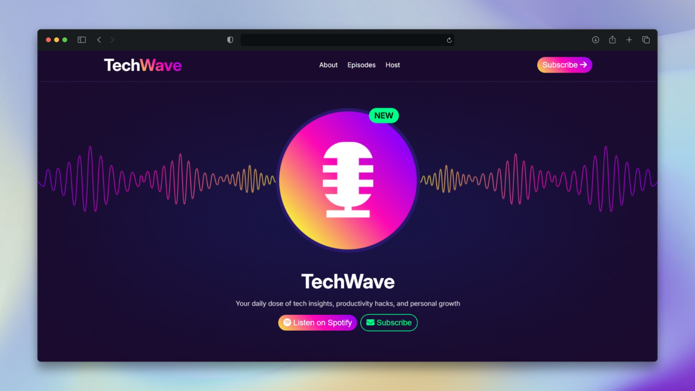

# TechWave

A responsive, single-page landing site for a technology podcast. TechWave presents the podcast's purpose, listener highlights, key benefits, featured episodes, host profile, and listening-platform links in a dark, gradient-led interface.

**Live site:** [arnnikislam.github.io/tech-wave](https://arnnikislam.github.io/tech-wave/)

## Preview



## Features

- Responsive navigation with a mobile hamburger menu
- Animated hero microphone and "NEW" badge
- About section with podcast statistics
- Responsive feature-card grid with hover states
- Featured-episode cards with artwork and durations
- Host profile and social-media icons
- Responsive layouts for mobile, tablet, and desktop screens

## Built with

- HTML5
- CSS3 (custom properties, Flexbox, Grid, media queries, and animations)
- [Inter](https://fonts.google.com/specimen/Inter), loaded from Google Fonts
- Font Awesome icons

## Project structure

```text
tech-wave/
├── index.html          # Page structure and mobile-menu script
├── styles/
│   └── style.css       # Styling, responsive rules, and animations
└── assets/             # Backgrounds, episode artwork, icons, and images
    └── banner/         # Featured episode images
```

## Run locally

This is a static site with no installation or build step required.

1. Clone the repository:

   ```bash
   git clone https://github.com/arnnikislam/tech-wave.git
   ```

2. Open `index.html` in a web browser.

For the closest local-server experience, serve the project directory with any static-file server, then open the address it provides.

## Deployment

The project is deployed through GitHub Pages at [arnnikislam.github.io/tech-wave](https://arnnikislam.github.io/tech-wave/).

## Author

Created by [Arnnik Islam](https://github.com/arnnikislam).
